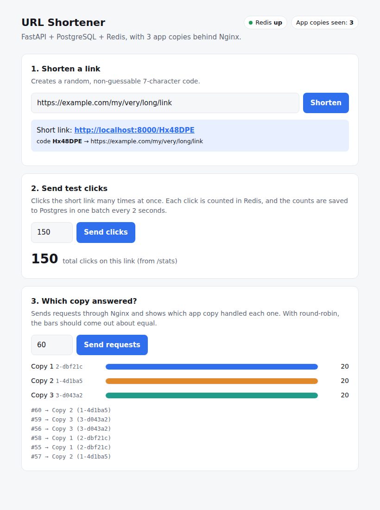

# URL Shortener

A URL shortener built in two measured versions. v2 fixes the weaknesses of v1 and is benchmarked before and after on the same machine, so every claim is backed by a number.

| Version | What changes | Status |
|---|---|---|
| **v1: naive baseline** | FastAPI + Postgres, base62 codes from the row id, click counted with a synchronous `UPDATE` on every redirect | ✅ tag `v1` |
| **v2: cache, buffered clicks, horizontal scale** | Redis cache-aside for lookups, clicks buffered in Redis and batch-flushed to Postgres, random non-guessable codes, 3 stateless app replicas behind Nginx, falls back to v1 behaviour if Redis is down | ✅ tag `v2` |

## v1 vs v2 results

Redirect endpoint, 50 concurrent users, 20 s per run, 30 "popular" links, measured with [autocannon](https://github.com/mcollina/autocannon) (`bench.js`). Everything ran in Docker Compose on a Windows laptop (Docker Desktop), v1 and v2 on the same machine, 3 runs of v1 and 4 of v2, averaged.

| | Throughput | p50 latency | p99 latency | Errors |
|---|---|---|---|---|
| **v1** | 857 req/s | 53 ms | 200 ms | 0 |
| **v2 (1 app copy)** | 999 req/s | 47 ms | 111 ms | 0 |
| **Change** | **+17%** | −12% | **−45%** | |

These v2 numbers are for a single app copy, measured before the Nginx + 3 replicas setup was added. A re-run with 3 replicas is pending.

**What this shows:**
- **The slowest requests improved the most.** v1's p99 was ~4× its p50 because clicks on the same popular link queued for one row lock in Postgres. v2 counts clicks in Redis instead, so that queue disappears and p99 drops by almost half.
- **Postgres writes on the redirect path fell by ~99.9%.** In a separate run with exact query counting (`pg_stat_statements`), v1 issued ~43,000 `UPDATE`s for ~43,000 clicks, and v2 issued 10 (one batch every 2 s). Every redirect was served from the Redis cache.
- **No clicks lost:** the server's click count matched the clicks sent on every run.
- **Runs vary** (v1: 712–1,061 req/s, v2: 790–1,201 req/s) because Docker Desktop shares the laptop with everything else, which is why the numbers above are averages.
- **The gain depends on where the bottleneck is.** On a faster Linux machine where Postgres wasn't the limit, both versions ran at ~2,100 req/s, capped by the single Python app process. v2 helps most when the database is the slow part, as it was here.

## Architecture (v2)

```
                         ┌── app replica 1 ──┐
Client ──▶ Nginx :8000 ──┼── app replica 2 ──┼──▶ Redis (memory)
          (round-robin)  └── app replica 3 ──┘      url:<code>      → long URL (cache, TTL 1h)
                                   │                clicks:pending  → {code: n} (click buffer)
                                   │ cache miss only        │
                                   ▼                        │ every 2 s, ONE batched UPDATE
                              PostgreSQL ◀──────────────────┘ (one replica at a time, via a Redis lock)
                           (source of truth)
```

- **Stateless replicas:** no app copy keeps data of its own. Everything lives in Redis or Postgres, so any copy can answer any request, and scaling up is changing `replicas: 3` in `docker-compose.yml`.
- **Nginx** is the only public entry point and spreads requests evenly across the copies.
- **Flush lock:** every replica runs a flusher, but a short Redis lock (`SET NX PX`) lets only one flush at a time, so clicks are never counted twice.

## Demo page

Open `http://localhost:8000/` to shorten a link, fire test clicks and watch the live click count, and send requests through Nginx to see which of the 3 app copies answered each one. Every response also carries an `X-Served-By` header (try `curl -i localhost:8000/health`).



## API

| Method | Path | Result |
|---|---|---|
| `POST` | `/shorten` | body `{"long_url": "https://…"}` → `201 {short_code, short_url, long_url}` |
| `GET` | `/{code}` | `302` redirect to the long URL (counts a click) |
| `GET` | `/{code}/stats` | `{short_code, long_url, click_count, created_at}` (includes clicks still buffered) |
| `GET` | `/` | demo page |
| `GET` | `/health` | `{"status": "ok", "redis": "ok" or "down"}` |

## Run it

```bash
docker compose up --build            # Postgres + Redis + 3 app replicas + Nginx on :8000
# then open http://localhost:8000 for the demo page
curl -X POST localhost:8000/shorten -H 'content-type: application/json' \
     -d '{"long_url":"https://example.com"}'
```

To run v1 for comparison: `git checkout v1 && docker compose up --build`.

## Tests and benchmarks

```bash
PYTHONPATH=. pytest -q                                          # API tests auto-skip if Postgres/Redis are down
npm i autocannon@7
node loadtest/redirects.js http://localhost:8000 CODE1,CODE2 50 20   # url, codes, connections, seconds
```

## Project layout

```
app/
  main.py      app + startup/shutdown (starts the click flusher), demo page, X-Served-By header
  static/      index.html demo page
  routes.py    endpoints, cache-aside lookup, Redis-down fallback
  cache.py     Redis: link cache + click buffer
  flusher.py   background batch flush of clicks to Postgres (with a Redis lock)
  codes.py     random non-guessable short codes
  db.py        Postgres pool + schema
  base62.py    base62 alphabet/encoding
  schemas.py   request/response validation
  config.py    env-var settings
tests/         unit + API tests
loadtest/      redirects.js (autocannon), bench.py (simple Python tester)
docs/          LEARN.md (v1), LEARN-v2.md (v2)
nginx.conf     load balancer config for the app replicas
```
