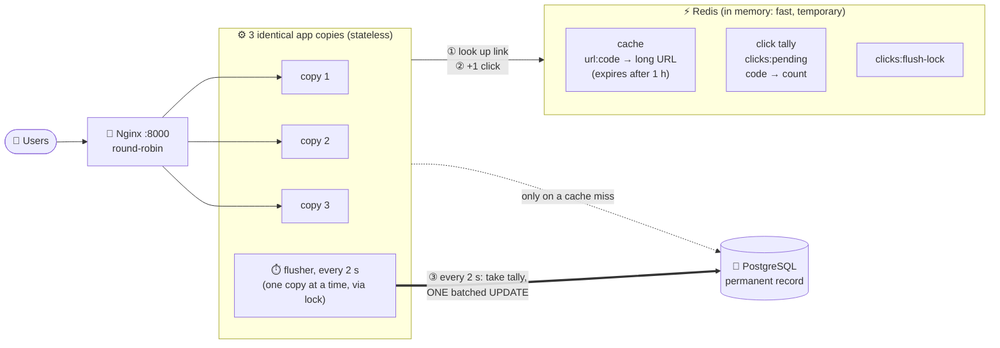
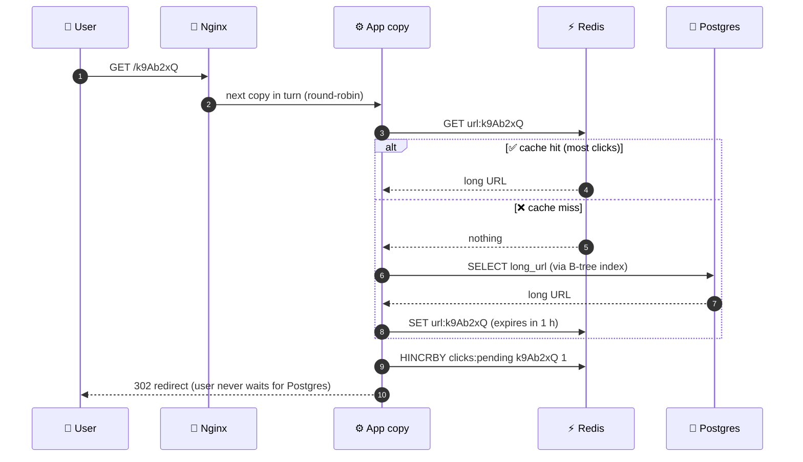
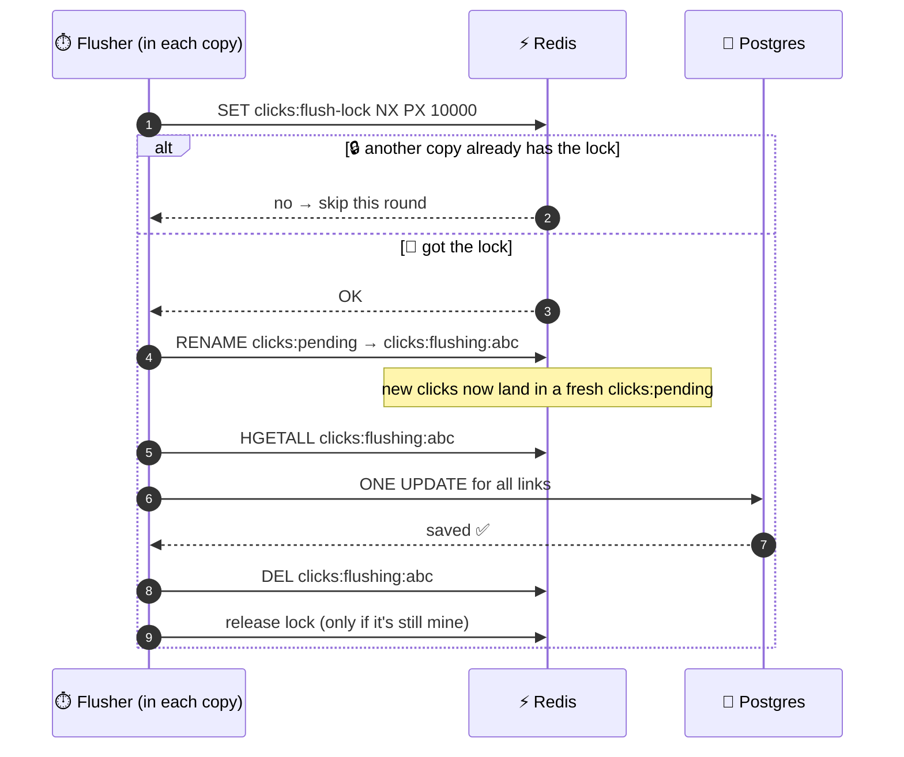
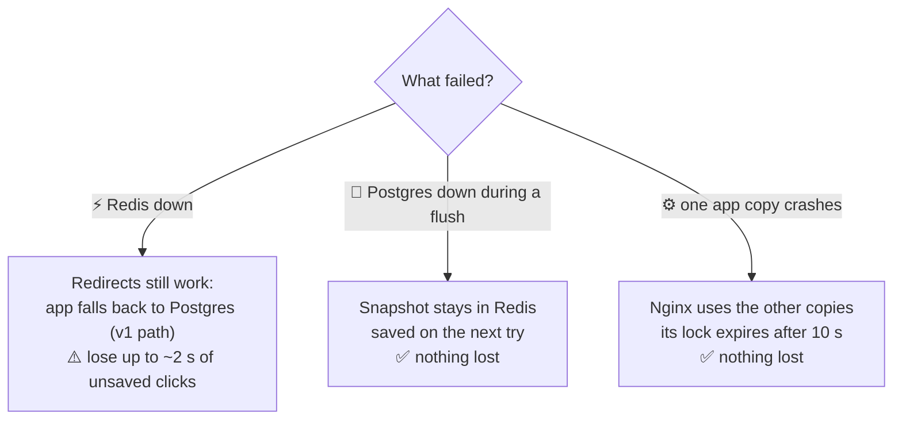
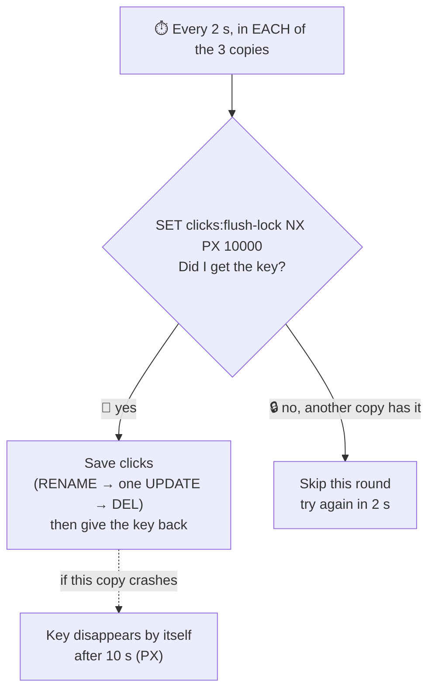
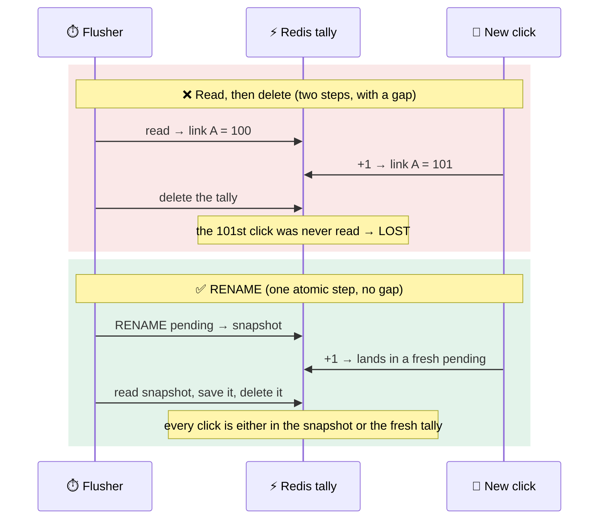
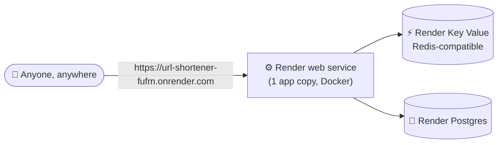

# Learning notes: v2

Read this after you're comfortable with v1. Same rule: be able to explain it out loud without looking.

---

## 1. The 30-second pitch (updated)

> "I built a URL shortener with FastAPI and Postgres in two measured versions. In v1, every click did a database write, and clicks on a popular link queued for the same row lock. In v2 I added Redis: popular links are served from an in-memory cache, and click counts are buffered in Redis and saved to Postgres in one batch every 2 seconds. I also made the app stateless and ran 3 copies behind Nginx, so it scales by adding copies. I load-tested both on my laptop: throughput went up 17%, the slowest 1% of requests got 45% faster, database writes dropped by 99.9%, and no clicks were lost."

If they ask for more, add the bug story (section 3) and the "it depends where the bottleneck is" point. Both show you measured instead of assuming.

---

## 1b. Architecture at a glance (v2)

**The big picture:** Nginx spreads users across 3 identical app copies. Redis handles the fast, frequent work (lookups and click counting). Postgres is the permanent record.

| Part | Job | Why it's there |
|---|---|---|
| **Nginx** | Sends each request to the next app copy in turn | One Python process only uses one CPU core |
| **3 app copies** | Identical and stateless | Any copy can answer any request; add more by changing one number |
| **Redis cache** | `code → long URL` | Most redirects never touch Postgres |
| **Redis click tally** | `+1` per click in memory | No row lock, no disk write per click |
| **Flusher + lock** | Every 2 s, one copy saves all counts in one batch | 1 write instead of thousands; the lock stops double counting |
| **Postgres** | Links + final click counts, saved to disk | Permanent, safe (ACID) |

### A click, step by step

### Saving clicks, every 2 seconds

### If something breaks

---

## 2. The 5 changes in v2

### Change 1: Redis cache ("cache-aside")
**Problem in v1:** every click asked Postgres "what's the long URL for code X?"

**Fix:** keep the answer in Redis, which lives in **RAM**, so it's much faster than disk.

**How cache-aside works (3 steps):**
1. Click comes in → ask **Redis** first: "do you have `url:k9Ab2xQ`?"
2. **Hit** → use it. Postgres isn't touched at all.
3. **Miss** → ask Postgres, then **save the answer into Redis** so the next click is a hit.

"Aside" = the cache sits *beside* the database, and **your code** decides when to read and fill it.

**TTL (time to live) = 1 hour:** each cached link expires after an hour unless it's used again. Unpopular links fall out on their own, so Redis memory is only spent on links people actually click.

**Warm on create:** when you shorten a link, v2 puts it in Redis immediately, so even the first click is a hit.

### Change 2: Click buffer + batch flush (the big one)
**Problem in v1:** every click = one `UPDATE` in Postgres, which means a row lock and a disk write.

**Fix:**
- On each click: `HINCRBY clicks:pending <code> 1` in Redis. That's "add 1 to this code's counter" in memory. It's **atomic**, meaning 1,000 simultaneous clicks all get counted correctly, with no lock queue.
- A **background task (the flusher)** runs every 2 seconds and writes all the counts to Postgres in **one** statement.

**Attendance-register analogy:** instead of 500 students each queueing for one pen, one class monitor collects a tally on paper and writes the totals into the register once every 2 seconds.

**How the flush avoids losing clicks (interviewers love this):**
1. `RENAME clicks:pending → clicks:flushing:<random id>`. RENAME is **atomic**, so any click arriving at that exact moment goes into a brand-new `clicks:pending`. Nothing is lost or counted twice.
2. Read the snapshot → run **one** batched `UPDATE` in Postgres.
3. **Only after Postgres confirms**, delete the snapshot. If Postgres was down, the snapshot stays in Redis and is retried next time.

**The accepted risk:** if **Redis** crashes, up to ~2 seconds of clicks can be lost. That's fine for analytics. It would **not** be fine for money. Say this in interviews; it shows you know the tradeoff.

**Stats stay accurate:** `/stats` adds up three things: clicks already in Postgres, clicks waiting in `clicks:pending`, and clicks in a snapshot that's **in the middle of being saved**. That third part was a bug I found while benchmarking (see section 3).

### Change 3: Random, non-guessable codes
**Problem in v1:** codes came from the row ID (1, 2, 3 → "1", "2", "3"), so anyone could guess every link.

**Fix:** pick 7 random characters from the 62 base62 characters.
- Uses Python's **`secrets`** module (cryptographically secure). The normal `random` module is predictable, so it's not safe here.
- 62⁷ ≈ **3.5 trillion** possible codes, so clashes are very rare.
- **If a clash happens anyway**, the `UNIQUE` constraint in Postgres rejects the insert, and the code tries a new random code (up to 5 times).
- Bonus: creating a link is now **one INSERT** (v1 needed INSERT + UPDATE).

**Why not a Snowflake ID?** Snowflake IDs are built from the **timestamp**, so they're harder to guess but still somewhat predictable and longer (about 10 to 11 characters in base62). Random 7-character codes are shorter and truly unguessable. That was a deliberate tradeoff.

### Change 4: Graceful degradation
If Redis goes down, the redirect **doesn't fail**. It catches the Redis error and falls back to the v1 way (read + update Postgres directly). Slower, but the site stays up. The `/health` endpoint reports `"redis": "down"` so you'd notice.

### Change 5: Several copies of the app behind Nginx (horizontal scaling)
**Problem:** one Python app process can only do so much work. On a fast machine it was the bottleneck (~91% CPU).

**Fix:** run **3 identical copies** (replicas) of the app, with **Nginx** in front as a **load balancer**.
- Nginx is the only thing users talk to (port 8000). It sends request 1 to copy 1, request 2 to copy 2, request 3 to copy 3, then starts again. That's called **round-robin**.
- Tested: 24,489 requests split exactly **8,163 / 8,163 / 8,163**.

**Why this works: the copies are "stateless."** No copy keeps anything important in its own memory. Links live in Postgres, and cache and clicks live in Redis. So **any copy can answer any request**, and if one copy crashes, the others carry on. To scale up, change `replicas: 3` to `replicas: 10`.

**The problem this created, and the fix (good interview point):** every copy runs its own flusher. If two copies flushed at the same moment, both could read the same snapshot and add those clicks to Postgres **twice**.
- **Fix: a Redis lock.** Before flushing, a copy runs `SET clicks:flush-lock <token> NX PX 10000`. **NX** = "only if nobody else holds it", so only one copy wins. **PX 10000** = the lock auto-expires after 10 seconds, so if the winner crashes, the lock doesn't stay stuck forever.
- The other copies see the lock is taken and simply skip that round.
- Tested: 2 flushers started at the exact same time, one did the work and one skipped, no double counting. And with 3 copies under load, Postgres matched the clicks exactly (24,488 = 24,488).

---

## 2b. Plain-words glossary

**Atomic:** happens completely in one step, with nothing able to sneak in the middle. Like a UPI payment: money leaves your account *and* reaches your friend's, or neither happens. There's no in-between moment where someone else could see or change it. `RENAME` in Redis is atomic: at one instant the key is called `clicks:pending`, at the next it's `clicks:flushing:abc`. A click arriving at that exact moment lands either in the old key (which becomes the snapshot) or in a brand-new `clicks:pending`. It can't get lost in between.

**Snapshot:** a frozen copy of the click tally at one moment. Think of the class monitor tearing off the current tally page and taking it to the office, while the class starts a fresh page. The torn-off page is the snapshot.

**The stats bug, in those words:** while the monitor is walking to the office with the torn-off page, those clicks are on neither the fresh page (`clicks:pending`) nor in the register (Postgres). The old `/stats` only looked at the fresh page and the register, so it missed the page in the monitor's hand for a moment. Now it also counts the page being carried.

**Batch:** doing many small things as one big thing. Instead of 1,000 separate "add 1" writes to Postgres, one write says "add 312 to link A, 540 to link B, 148 to link C".

**Batched clicks, tech used:**
- **Redis hash + `HINCRBY`:** the tally page. One counter per short code, +1 per click, in memory.
- **Python `asyncio` background task:** the monitor who wakes up every 2 seconds (`app/flusher.py`).
- **Postgres + `unnest`, sent with `asyncpg`:** one `UPDATE` statement that takes two lists (codes and counts) and updates every row at once.

**Cache-aside, super simple:** like a sticky note on your desk. Before walking to the library (Postgres), check the sticky note (Redis). If the answer is on it, done. If not, go to the library, get the answer, and write it on a sticky note for next time.

**"What if a link changes but the old one is cached?":** imagine a future "edit link" feature. Your short link `abc` points to `google.com`, and you edit it to point to `yahoo.com`. Postgres now says yahoo, but the sticky note in Redis still says google for up to 1 hour (the TTL), so people keep getting sent to google. Fix: when a link is edited, throw away its sticky note. That's called **cache invalidation**. v2 has no edit feature, so this is only a "what if" question.

**Base62 vs `secrets`:** base62 is just the **alphabet** (0-9, a-z, A-Z), not the security. The security comes from **how you pick** the characters.
- v1: counted `1, 2, 3…` and wrote each number in base62 → `1`, `2`, `3`… Easy to guess the next one.
- v2: picks each of the 7 characters **at random** from that alphabet → `k9Ab2xQ`, `P03mzLe`… There's no pattern, so you can't guess another link.
- `secrets` is the tool that does the random picking. Python's normal `random` module can be predicted by an attacker who sees enough outputs. `secrets` can't, so it's the right tool for anything that must not be guessable.

**Why base62 and not base64?** Standard base64 uses `+` and `/`, which have special meanings in URLs. There *is* a URL-safe version called **base64url** that uses `-` and `_` instead, so it would work too. Base62 was chosen because it has **no symbols at all**: codes are easier to read, type and copy. If an interviewer brings up base64url, agree that it works and give that reason.

**Why not a Snowflake ID?** A Snowflake ID is a big number built from **time + machine number + counter**. It's unique, but it's about 10 to 11 characters long in base62 and partly guessable (it's based on the clock). Random 7-character codes are shorter and not guessable. That was a deliberate tradeoff.

**Why call it "scalable"?** Scalable = it can handle more traffic by adding more machines, without redesigning it.
- **More users?** Add more app copies behind Nginx. It works because they're stateless.
- **More clicks?** Database writes don't grow with clicks. It's still one batch every 2 seconds, whether there are 100 clicks or 100,000.
- **More reads?** Popular links come from the Redis cache, not Postgres.

---

## 2c. Deeper answers (the questions that usually confuse people)

### Why is one Python process a bottleneck?
Python (the standard version, CPython) has a rule called the **GIL**: inside one process, **only one thread runs Python code at a time**. So one app process can keep only **one CPU core** busy, even if your laptop has 12.
- Waiting for Redis or Postgres is fine, because Python lets go of the GIL while waiting for the network. That's why async works so well.
- But the Python work itself (reading the request, building the response) happens on one core. When that core hits ~100% (we saw ~91%), requests start to queue.
- **Fix:** run **several processes**. Each one gets its own core. That's exactly what the 3 copies behind Nginx do. FastAPI's own docs describe this: several copies of the app, and one thing in front that spreads the requests.

### Can we make unlimited copies?
**No.** More copies only help until something else becomes the limit:
1. **CPU cores:** copies beyond the number of cores just fight over the same cores. More machines means more cost.
2. **Postgres connections:** each copy keeps up to 10 connections open, and Postgres allows **100 by default**. So around 10 copies would use them all, and copy 11 would get errors. (Fix at scale: a connection pooler like PgBouncer, or a bigger database.)
3. **Redis connections and memory:** the free Render Key Value allows 50 connections.
4. **The bottleneck moves:** once the app copies are fast enough, the database, Redis, or the network becomes the slow part. Adding copies then does nothing.

**In an interview:** *"Scaling out works until the next shared resource saturates, usually database connections. Then you add pooling, read replicas, or shard."*

### The Redis lock, more simply
All 3 copies run their own "save clicks to Postgres" job every 2 seconds. If two of them grabbed the same tally at the same moment, both would add it to Postgres, and **those clicks would be counted twice**.

**The lock is like a single bathroom key at a shop counter:**
- Before saving, a copy asks Redis: *"Give me the key, but only if nobody else has it."* That's `SET clicks:flush-lock <my-id> NX PX 10000`.
  - **NX** = only if the key doesn't exist yet (nobody holds it).
  - **PX 10000** = the key disappears on its own after 10 seconds. So if the copy holding it crashes, the key isn't lost forever.
- **Got the key?** Do the save, then give the key back. It's only given back if it's still *your* key, which is checked with the `<my-id>`.
- **Didn't get it?** Someone else is saving right now, so skip this round. Try again in 2 seconds.

Redis handles one command at a time, so two copies can never both get the key.

### "The page in the monitor's hand" (the stats bug), step by step
Picture clicks being tallied on a page called `clicks:pending`.
1. **Every 2 s, the flusher renames that page** to `clicks:flushing:abc`. It's like tearing it off the pad and carrying it to the office. A new, empty `clicks:pending` starts for new clicks.
2. **It saves the torn-off page into Postgres**, then throws it away.

Between steps 1 and 2 (a few milliseconds), those clicks are **only** on the torn-off page. They're not in `clicks:pending` anymore, and not in Postgres yet.
- **Old `/stats`** added up Postgres + `clicks:pending`, so it **missed the torn-off page**, and the number briefly dropped (15,791 sent → 15,756 shown).
- **New `/stats`** also adds any `clicks:flushing:*` page, so the number is always right.

### Why RENAME before reading?
Imagine the flusher instead did "read the page, then clear it" as **two separate steps**:
- It reads: "link A = 100 clicks".
- A new click arrives, and the page now says 101.
- It clears the page, and **that 1 click is gone forever**. ❌

`RENAME` does the "take the page away" in **one single step that nothing can interrupt** (that's what **atomic** means). Any click arrives either **before** the rename (so it's on the page being saved) or **after** it (so it's on the fresh page). There's no gap where a click can fall through. ✅

### What if Redis memory fills up during those 2 seconds?
**It won't, for two reasons:**
1. **The tally doesn't grow with clicks.** It stores one counter **per link**, not one entry per click. A million clicks on one link is still **one** small number that goes up. It only grows with the number of *different* links clicked in 2 seconds. Redis also packs small tallies (up to 512 entries) very tightly.
2. **Cached links expire** after 1 hour, so old ones leave on their own.

**But if memory ever did fill up:** Redis's default setting (`noeviction`) is to **refuse new writes with an error** while still allowing reads. In our app, a Redis error means the click **falls back to the v1 path**, so it's written straight to Postgres. Slower, but **no click is lost** and the site stays up. (In production you'd set a memory limit and an eviction policy like `allkeys-lru` for the cache, and monitor memory.)

---

## 3. The benchmark story (know this well)

### Your numbers (your laptop, Docker Desktop on Windows)
50 fake users clicking 30 popular links for 20 seconds. v1 ran 3 times and v2 ran 4 times, then averaged.

| | Clicks per second | p50 (typical click) | p99 (slowest 1%) | Errors |
|---|---|---|---|---|
| **v1** | 857 | 53 ms | 200 ms | 0 |
| **v2** | 999 | 47 ms | 111 ms | 0 |
| **Change** | **+17%** | −12% | **−45%** | |

**What each number means:**
- **Clicks per second (throughput):** how many clicks the server handled every second. Higher is better.
- **p50:** half of all clicks were answered faster than this. It's the "normal" experience.
- **p99:** 99 out of 100 clicks were faster than this. It's the "worst normal" experience.

**Why p99 improved the most:** in v1, the p99 (200 ms) was about 4× the p50 (53 ms). That gap means some clicks were **waiting in line** for the row lock on a popular link. v2 counts clicks in Redis, so that line disappears and the slow tail shrinks by almost half.

**Why the runs varied** (v1: 712 to 1,061, v2: 790 to 1,201): Docker Desktop shares the laptop with everything else running on it. That's why you ran each version several times and averaged. Say this in interviews; it shows you know one run isn't enough.

### Database writes (measured separately, with exact query counting)
| | Clicks | Postgres `UPDATE` statements |
|---|---|---|
| v1 | ~43,000 | **~43,000** (one per click) |
| v2 | ~41,000 | **10** (one batch every 2 seconds) |

That's the **99.9% fewer database writes**. It was counted with `pg_stat_statements`, a Postgres extension that counts exactly how many times each query ran.

### "It depends where the bottleneck is" (bonus point)
On a faster Linux machine, both versions ran at ~2,100 clicks/sec, with **no** speed difference. The reason: the database there was fast, and the single Python app process was the limit (busy at ~91% CPU). v2 only speeds things up when the **database** is the slow part, like on your laptop, or when the database is shared, remote, or under heavy load.

**Toll booth vs bridge:** v2 widens the bridge (the database). If the jam is at the toll booth (the Python app), widening the bridge doesn't help. On your laptop the jam was at the bridge, so it did.

### The bug you found (great interview story)
In one v2 run you sent **15,791** clicks, but `/stats` showed **15,756**, so 35 were "missing."
- **Cause:** during a flush, clicks are moved into a snapshot before being saved to Postgres. For that moment they were in neither `clicks:pending` nor Postgres, so `/stats` didn't count them. They weren't lost, just in transit.
- **Fix:** `/stats` now also counts clicks in any snapshot that's being saved.
- **Proof:** a regression test that fails on the old code (shows 0 instead of 4) and passes on the new code.

> "While benchmarking, I noticed the stats were slightly lower than the clicks I'd sent. I traced it to clicks in transit during the batch save, fixed it, and added a regression test."

### How the numbers were measured
- **autocannon** (`bench.js`): a fast load-testing tool that pretends to be 50 users, times every answer, and counts them.
- **Same laptop, back to back**, so v1 and v2 are compared fairly.
- **No lost clicks:** the clicks the server counted matched the clicks sent on every run.
- My first load tester (Python) was itself maxed out at 100% CPU, so it measured the tester, not the app. That's why I switched to autocannon.

### Resume line
> **URL Shortener** | [Live demo](https://url-shortener-fufm.onrender.com) | [GitHub](https://github.com/its-yashjai/URLshortner/tree/v2)
> - Built a scalable URL shortener with PostgreSQL, Redis caching, and random, collision-safe short codes.
> - Designed a stateless architecture with 3 replicas behind an Nginx load balancer and batched click counting in Redis.
> - Cut p99 latency by 45% (200 → 111 ms) and database writes by 99.9%, and raised throughput 17% (857 → 999 req/s), validated with load tests.
> - **Tech Stack:** Python, FastAPI, PostgreSQL, Redis, Nginx, Docker

---

## 3b. Live deployment (Render)

**Live link:** https://url-shortener-fufm.onrender.com

**How it's deployed:** `render.yaml` is a **Blueprint**, a file that tells Render what to create. One click created 3 things and connected them automatically:
- **Web service:** your app, built from the `Dockerfile`
- **Postgres database:** Render passes its address to the app as `DATABASE_URL`
- **Key Value store (Redis-compatible):** passed as `REDIS_URL`

**Two small code changes made it work on Render:**
- **Port:** Render tells the app which port to listen on through the `PORT` setting, so the Dockerfile uses `${PORT:-8000}` (Render's port, or 8000 on your laptop).
- **Short-link address:** short links must start with the real website address, not `localhost`. Render provides it as `RENDER_EXTERNAL_URL`, and the app uses that automatically.

**Local vs live:**
| | Your laptop (Docker Compose) | Render (free) |
|---|---|---|
| App copies | 3, behind Nginx | 1 (Render routes traffic itself) |
| Always on | While Docker runs | Sleeps after 15 min idle, wakes in ~1 min |
| Database | Local Postgres | Render Postgres (free one expires after 30 days). Neon's free plan doesn't expire, but its database sleeps after 5 min idle, so the first query after a pause is slower |

**How to prove Redis works on the live site:**
1. Open `/health`. It should show `"redis": "ok"`, which is the app itself asking Redis "are you there?"
2. Send 50 clicks on the demo page. The count shows 50 immediately, before Postgres has saved anything. That's Redis holding the clicks.

**Story from deployment:** after going live, the demo page showed "Redis unreachable" in one browser even though `/health` said `"redis": "ok"`. I checked in a second browser and it showed "up", so the app was fine and a browser extension was blocking the page's background check. Lesson: **check the source of truth (`/health`) before assuming the backend is broken.**

---

## 3c. Live benchmark in the app

The demo page has a **"4. Benchmark: v1 vs v2"** section. It creates two test links, then fires the same number of clicks at:
- `/bench/v1/<code>`: the **exact** v1 code (one Postgres `UPDATE` per click)
- `/bench/v2/<code>`: the **exact** v2 code (Redis cache lookup + Redis click counter)

It shows clicks/sec, p50, p95, p99 and errors for each, plus bars and the % change. Both endpoints return **204 No Content** instead of a redirect, so the browser measures the server's work, not a trip to another website.

Example run (3 copies behind Nginx, 1,000 clicks each, 20 at a time): v1 ≈ 520 clicks/s, v2 ≈ 610 clicks/s (about **+15%**), with v2 faster at p50 and p99. Numbers vary run to run.

**Why the resume uses autocannon numbers, not these:** the page runs **in your browser**, so it includes your network and the browser's own limits (about 6 connections per site over HTTP/1.1; HTTP/2 shares one connection). It's great for a **live demo**. autocannon is the proper measuring tool.

**Interview use:** open the live link, click "Run benchmark", and explain the table. It shows you understand what you built.

---

## 3d. Checked against official docs

Every technical claim in these notes was checked against the official source. If an interviewer pushes back, this is where the fact comes from.

| Claim | What the docs say | Source |
|---|---|---|
| `RENAME` is atomic | Constant-time, atomic. If the new name already exists it's overwritten (we always use a fresh random name, so nothing gets overwritten) | [Redis RENAME](https://redis.io/docs/latest/commands/rename/) |
| `UNIQUE` creates an index | Postgres automatically creates a unique index to enforce it, and only B-tree indexes can be unique | [PostgreSQL: unique indexes](https://www.postgresql.org/docs/current/indexes-unique.html) |
| Use `secrets`, not `random` | `random` is "designed for modelling and simulation, not security" | [Python secrets](https://docs.python.org/3/library/secrets.html) |
| Nginx spreads requests evenly | A name that resolves to several addresses becomes several servers, and the default method is (weighted) round-robin | [Nginx upstream](https://nginx.org/en/docs/http/ngx_http_upstream_module.html) |
| 301 is cached by browsers | 301 is permanent and commonly sent with long cache times, which is why it can hide clicks from the server | [MDN 301](https://developer.mozilla.org/en-US/docs/Web/HTTP/Reference/Status/301) |
| base64url exists | Same as base64 but `+` → `-` and `/` → `_`, safe in URLs | [RFC 4648 §5](https://datatracker.ietf.org/doc/html/rfc4648#section-5) |
| Render free plan | Web service sleeps after 15 min idle, free Postgres expires after 30 days, free Key Value isn't saved to disk | [Render free plan](https://render.com/docs/free) |
| Neon free plan | Permanent (not a trial), 0.5 GB per project, database sleeps after 5 min idle | [Neon pricing](https://neon.com/pricing) |
| Python GIL | Only one thread runs Python bytecode at a time; released during I/O | [Python glossary: GIL](https://docs.python.org/3/glossary.html#term-global-interpreter-lock) |
| Scale with several processes | Run multiple worker processes/containers with something in front distributing requests | [FastAPI deployment concepts](https://fastapi.tiangolo.com/deployment/concepts/) |
| Postgres connection limit | `max_connections` default is typically 100 | [PostgreSQL connection settings](https://www.postgresql.org/docs/current/runtime-config-connection.html) |
| Redis when memory is full | Default `maxmemory-policy` is `noeviction`: writes return an error, reads still work | [redis.conf](https://raw.githubusercontent.com/redis/redis/unstable/redis.conf), [Redis eviction](https://redis.io/docs/latest/develop/reference/eviction/) |
| Small Redis hashes are compact | Small hashes (≤512 entries by default) use a compact encoding, up to 10× less memory | [Redis memory optimization](https://redis.io/docs/latest/operate/oss_and_stack/management/optimization/memory-optimization/) |
| Browser connection limit | About 6 parallel connections per site on HTTP/1.1; HTTP/2 multiplexes | [MDN: HTTP/1.x connections](https://developer.mozilla.org/en-US/docs/Web/HTTP/Guides/Connection_management_in_HTTP_1.x) |

**Corrections made after checking** (earlier versions of these notes said otherwise):
- "Base64 isn't URL-safe" was incomplete, because base64url exists.
- Snowflake codes are about **10 to 11** characters in base62, not "~11".
- Neon's free database doesn't expire, **but** it sleeps after 5 minutes idle.

---

## 4. Interview questions for v2 (practise out loud)

1. **What is cache-aside?** Check the cache, on a miss read the DB and fill the cache.
2. **Why is Redis fast?** It keeps data in memory (RAM), not because it's "NoSQL."
3. **What's a TTL, and why use one?** It's an expiry time. Unpopular links fall out of the cache, which saves memory.
4. **What if a link's URL changes but the old one is still cached?** Stale data for up to the TTL. Fix: delete the cache key when the link is updated (called *cache invalidation*). v2 has no edit feature, so it isn't a problem yet.
5. **How do you count clicks without writing to Postgres every time?** `HINCRBY` in Redis, then a batched flush every 2 seconds.
6. **What if Redis crashes?** You lose up to ~2 seconds of click counts. That's acceptable for analytics. You could enable Redis persistence (AOF) to shrink that window.
7. **What if Postgres is down during a flush?** The snapshot stays in Redis and is retried on the next tick. Delayed, not lost.
8. **Why RENAME before reading the buffer?** It's atomic, so new clicks go to a fresh buffer and nothing is lost or double-counted.
9. **How are random codes kept unique?** The UNIQUE constraint rejects a clash, and the app retries with a new code.
10. **Why `secrets` and not `random`?** `random` is predictable. `secrets` is cryptographically secure.
11. **Did v2 make it faster?** On my laptop, yes: +17% throughput and 45% lower p99, averaged over several runs. The biggest win was the slow tail, because the row-lock queue disappeared. On a faster machine where the database wasn't the bottleneck, throughput stayed the same, because the Python process was the limit there.
12. **How does it scale?** Stateless app copies behind Nginx (add more copies), a Redis cache for reads, and batched writes, so the database load doesn't grow with clicks.
13. **Several copies each run a flusher. Why don't clicks get counted twice?** A Redis lock (`SET NX PX`) lets only one copy flush at a time. The lock expires on its own if that copy crashes.
14. **What does "stateless" mean, and why does it matter?** No copy keeps important data in its own memory, so any copy can serve any request and copies can be added or removed freely.
15. **Why run the benchmark several times?** Results varied by up to ~30% between runs because Docker shares the laptop with other programs. Averaging several runs gives a number you can trust.
16. **Tell me about a bug you found.** The in-transit clicks bug in section 3: noticed it in the benchmark output, found the cause, fixed it, and added a regression test.
17. **What would you do next?** Postgres read replicas for more read traffic, and Redis persistence (AOF) to shrink the "lost clicks if Redis crashes" window.
18. **Why did the first request after a while take ~1 minute?** Render's free plan puts the app to sleep after 15 idle minutes (a "cold start"). Paid plans keep it always on.
19. **Why does the live site run 1 copy but your laptop runs 3?** On the free plan Render runs one instance and handles routing itself. The 3 copies + Nginx setup shows horizontal scaling locally. On a paid plan you'd just raise the instance count.
20. **How do you know Redis is healthy in production?** The `/health` endpoint pings both Postgres and Redis and reports each one.
21. **Why base62 and not base64url?** base64url would also work. Base62 has no symbols at all, so codes are easier to read, type and copy.
22. **Can you add unlimited app copies?** No. It helps until the next shared limit: CPU cores, Postgres connections (100 by default), Redis connections, or cost. Then you add a connection pooler, read replicas, or sharding.
23. **What if Redis runs out of memory?** The click buffer is one counter per link, so it stays tiny. If Redis were full, its default is to reject writes, and the app falls back to writing clicks directly to Postgres, so nothing is lost.
24. **How can I see the v1 vs v2 difference myself?** Open the live demo, section 4, and run the benchmark.
